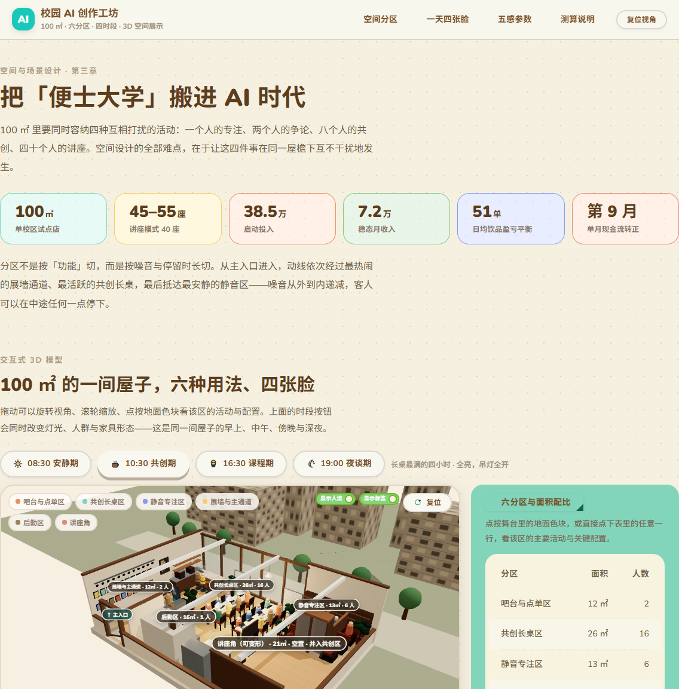
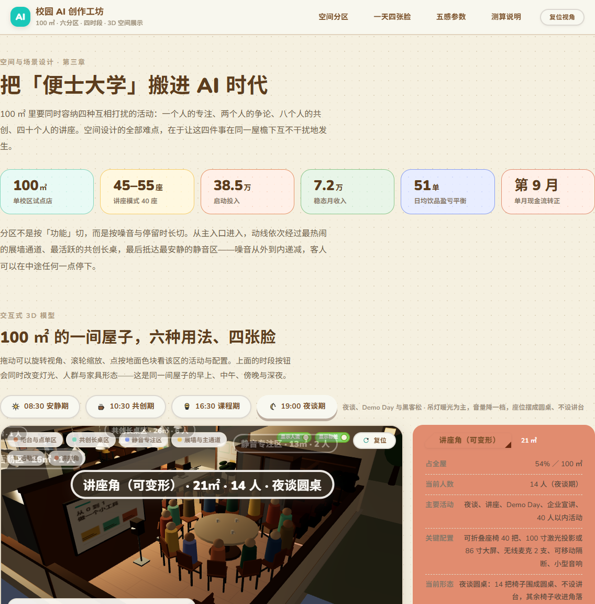

# 校园 AI 创作工坊 · 3D 场景展示站

把《校园 AI 创作工坊》企划书第三章的 100㎡ 空间格网规格，建成一个可交互的实时 WebGL 展示站：环绕观察、点选分区、切换一天四个时段、演示讲座角变形。



> 图为 10:30 共创期：长桌坐满、吊灯全开；右侧面板是六分区与面积配比。

## 功能

- **环绕 3D 户型台**：拖拽旋转、滚轮缩放、复位视角；西墙（含主入口门洞）与北墙（三扇落地窗）保留为剖切立墙，东/南敞开。
- **六分区点选**：吧台与点单区 12㎡／共创长桌区 26㎡／静音专注区 13㎡／展墙与主通道 12㎡／后勤区 16㎡／讲座角 21㎡。点舞台地面色块或右侧表格任意一行，出该区的主要活动、关键配置、本时段人数占比。
- **一天四张脸**：08:30 安静期 / 10:30 共创期 / 16:30 课程期 / 19:00 夜谈期。切换时段会同时改变灯光氛围（夜谈期窗外校园楼亮灯）、人群数量与分布、讲座角形态与营收占比。
- **讲座角三形态**：讲座式 / 圆桌围坐 / 并入共创区，40 把折叠椅逐把错峰动画过渡，隔断与大屏同步平移。
- **其它**：显示人流 / 显示分区标签开关；五感氛围参数（视觉/听觉/嗅觉/触觉/可达性）；核心数字条；页脚测算说明与来源。



> 图为 19:00 夜谈期，相机已聚焦讲座角：14 把椅子围成圆桌、不设讲台。

## 技术栈

| 项 | 选型 |
|---|---|
| 构建 | Vite 8（Rolldown 内核）+ TypeScript 5.9（`strict`，构建前置 `tsc --noEmit`） |
| 框架 | React 19.3.0（精确锁定，不带 `^`） |
| 3D | three 0.186 + @react-three/fiber 9.8 + @react-three/drei 10.7（仅用 `OrbitControls` 与 `Html`） |
| UI 组件库 | [animal-island-ui](https://www.npmjs.com/package/animal-island-ui) 2.0.0（动森风）+ naive-icons |
| 状态 | React Context + `useReducer`（无额外状态库） |

几何与材质全部程序化生成（`RoundedBoxGeometry` + 合并 + 实例化），**不依赖任何外部模型 / HDR / 网络字体 / CDN 资源**，构建产物是完全自包含的静态站点。

## 快速开始

要求 Node.js `>=22.12`（vite 8 的 engines 要求，已在 `package.json` 声明）。

```bash
npm install
npm run dev        # http://localhost:5173
npm run typecheck  # tsc --noEmit
npm run build      # tsc --noEmit && vite build → dist/
npm run preview    # 本地起静态服务预览 dist/，http://localhost:4173
```

## 目录结构

```
campus-ai-workshop-3d/
├── index.html · package.json · tsconfig.json · vite.config.ts · vercel.json
├── doc/                            # 实施文档与交付记录（含预览截图）
└── src/
    ├── main.tsx                    # animal-island-ui 样式 → 全局样式 → <App/>
    ├── App.tsx                     # <Cursor><Background> 外壳 + 四个章节
    ├── data/
    │   ├── room.ts                 # 房间尺寸、墙体开口、六分区矩形/配色/相机偏移
    │   ├── timeModes.ts            # 四时段：光照参数、人群锚点、营收占比、强制布局
    │   ├── layouts.ts              # 讲座角三种形态 → 40 把椅子的 {pos, rotY}
    │   └── content.ts              # 章节文案、核心数字、五感参数、页脚声明
    ├── scene/
    │   ├── WorkshopScene.tsx       # <Canvas>（透明底，叠在按时段变色的 CSS 舞台上）
    │   ├── RoomShell.tsx           # 地板/剖切立墙/窗/门洞/天花/吊灯
    │   ├── Zones.tsx · Furniture.tsx · HallZone.tsx   # 六分区家具与可变形讲座角
    │   ├── Occupants.tsx · ZoneLabels.tsx             # 人群与分区标签（可开关）
    │   ├── Lighting.tsx            # 按时段驱动的灯光组
    │   ├── CameraRig.tsx           # 阻尼 fly-to 聚焦 / 复位
    │   ├── instancing.tsx          # 实例化通用件
    │   └── palette.ts              # 材质色板与程序化贴图（木地板/屏幕/画框）
    ├── store/sceneStore.tsx        # mode / layout / selectedZone / 开关 / resetToken
    ├── styles/global.css           # 版式栅格与自有容器样式（不碰组件库内部类名）
    └── ui/                         # Hero · SceneSection · ZonePanel · TimelineSection · SenseSection · Layout
```

## 数据来源与口径

- 空间规格、六分区面积与配置、四时段营收占比、五感验收参数，逐条对齐企划书第三章（`../campus-ai-workshop/03-space.html`，即 `campus-ai-workshop` 项目的表 3-1 / 表 3-2）。
- 财务数字（启动投入 38.5 万、稳态月收入 7.2 万、日均 51 单盈亏平衡、第 9 个月现金流转正）均为**企划测算，非实际经营数据**，页脚已标注。

## 部署到 Vercel

项目是纯静态产物（无 SSR、无服务端函数、无客户端路由），Vercel 上零配置即可部署，仓库内已放好 `vercel.json`（框架预设 vite、构建 `npm run build`、输出 `dist`、`/assets/*` 长缓存 immutable）。

**方式一 · Git 导入（推荐）**：把本目录推到 GitHub/GitLab，在 Vercel 新建项目导入仓库，框架预设会自动识别为 Vite，无需改动任何设置，直接 Deploy。

**方式二 · CLI**：

```bash
npx vercel          # 预览部署（首次会要求登录并确认项目设置）
npx vercel --prod   # 生产部署
```

注意事项：

- Node 版本：`package.json` 已声明 `engines.node >= 22.12.0`，Vercel 会据此选择满足条件的 Node（勿降到 20.19 以下）。
- `.gitignore` 已排除 `node_modules/`、`dist/`、`.vercel/`；用 CLI 部署时也会按它跳过这些目录。
- 无需 SPA 重写规则（页面无路由），无需环境变量。
- 首屏资源：JS 约 1.4MB（gzip 约 370KB）+ 中文字体约 3.5MB（Noto Sans SC 三个字重，随组件库分发）。若要压体积，可覆盖 `--animal-font-family` 去掉 Noto，回落到系统 CJK 字体。

## 本地验证与已知事项

- `npm run build` 干净通过（tsc 无错误、711 模块、约 0.5s）；`npm run preview` 下已在浏览器逐项验证：WebGL 正常出图、字体加载完成、六分区点选面板数据正确、四时段灯光/人群/形态切换正常、相机聚焦与复位正常，控制台无 error（仅 three 内部 `THREE.Clock` 弃用 warning，来自依赖）。
- 需要支持 WebGL2 的浏览器；不支持时 canvas 不会出图（页面其余内容仍可读）。
- 实施过程、偏差与交付记录见 [`doc/v0.5-01-3d-scene-site.md`](./doc/v0.5-01-3d-scene-site.md)。
